# 🤖 Desafio Azure Frontier Girls: Agente ESG
### Projeto de Amanda Morais

Este é o projeto de entrega para o **Build Your First Copilot Challenge**, parte do programa Azure Frontier Girls da Microsoft e WoMakersCode.

---

## 1. Descrição do Projeto e Objetivo do Agente

### O Problema
Gestores públicos e analistas de ESG (Environmental, Social, Governance) precisam tomar decisões rápidas, baseadas em dados, para criar políticas de sustentabilidade e inclusão social. Estimar rapidamente o custo de programas de "empregabilidade verde" é um desafio comum que depende de cálculos manuais.

### O Objetivo do Agente (O Produto)
Este projeto é um **Agente de IA (Copiloto)** que atua como um "Assistente de Políticas Públicas ESG".

Seu objetivo é fornecer uma interface de conversação simples para que um gestor público possa estimar o custo de um programa de empregabilidade, simplesmente perguntando em linguagem natural.

## 2. A Ação Funcional (Entrega Técnica)

A "Ação Funcional" entregue neste projeto é um **cálculo**. O agente utiliza uma "Tool" (ferramenta) personalizada em Python (`calcular_custo_empregabilidade`) para executar a lógica de negócio e retornar o valor exato.

### Fluxo de Execução
O agente utiliza um orquestrador do Microsoft Agent Framework para analisar a intenção do usuário e rotear a tarefa para a ferramenta correta.

**Diagrama do Fluxo:**

```mermaid
graph LR
    A[Usuário] -->|Pergunta sobre Custo| B(Orquestrador)
    B -->|Identifica Intenção| C{Agente ESG}
    C -->|Chama Tool| D[calcular_custo_empregabilidade]
    D -->|Valida & Calcula| D
    D -->|Retorna Valor R$| C
    C -->|Resposta Final| A
    
    style C fill:#d4f1f4,stroke:#0078d4,stroke-width:2px
    style D fill:#e1f5fe,stroke:#0078d4,stroke-width:2px
```

## 3. Prints de Respostas e Execução

Abaixo está o print (screenshot) da execução do agente no notebook `criacao_agentes.ipynb`, mostrando a pergunta do usuário e a resposta final gerada pela IA após usar a "Tool" de cálculo.

> **[📸 ]**
> **[📸 ]**

## 4. Links de Referências

* **[Azure AI Foundry (AI Studio)](https://learn.microsoft.com/azure/ai-studio/)**: Documentação do portal usado para o deploy do modelo.
* **[Microsoft Agent Framework](https://github.com/microsoft/agent-framework)**: Documentação do framework utilizado para construir o agente.
* **[Repositório Base do Programa](https://github.com/Igomes01/azure_frontier_girls_fundamentos_ia)**: O código base fornecido pelo programa.
* **[Análise de Dados (TCC)](https://github.com/a-learte/azure-copilot-agente-esg)**: Este agente é baseado nos modelos de custo desenvolvidos na minha Tese de MBA em Data Science & Analytics (USP). O repositório completo da análise (em inglês) pode ser encontrado aqui https://github.com/a-learte/azure-copilot-agente-esg.